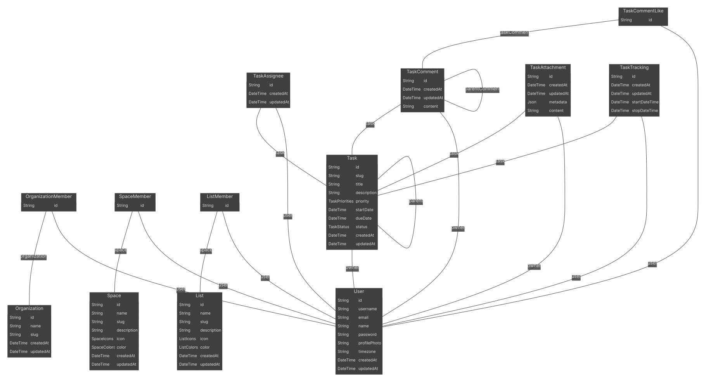

# OpenTasks
OpenTasks is an OpenSource project that lets you and your team manage tasks in a easy way.

## How it works
An user can create an organization which can contain different spaces, each space can contain lists, and each list can contain tasks. This way the tasks, which are the core of the application, can be well organized.

Other features includes:   
- A user can be member of different organizations.   
- Tasks can be shared without the need of a user being part of an organization, space, or list.   

## Getting Started
1. Install packages with:
```bash
pnpm install
```

2. Configure the environment variables, rename `.env.template` to `.env`.   

3. Create Postgres Database container with Docker:
```bash
docker-compose up -d
```

4. Generate Prisma client to add typing to database models:
```bash
pnpm dlx prisma generate
```

5. Run the database seed with:
```bash
pnpm seed
```

6. Run the project with:
```bash
pnpm dev
```

## How is it built

The main models in the database are the user, the task, organization, space, and list, the other models are just to complement those models.


